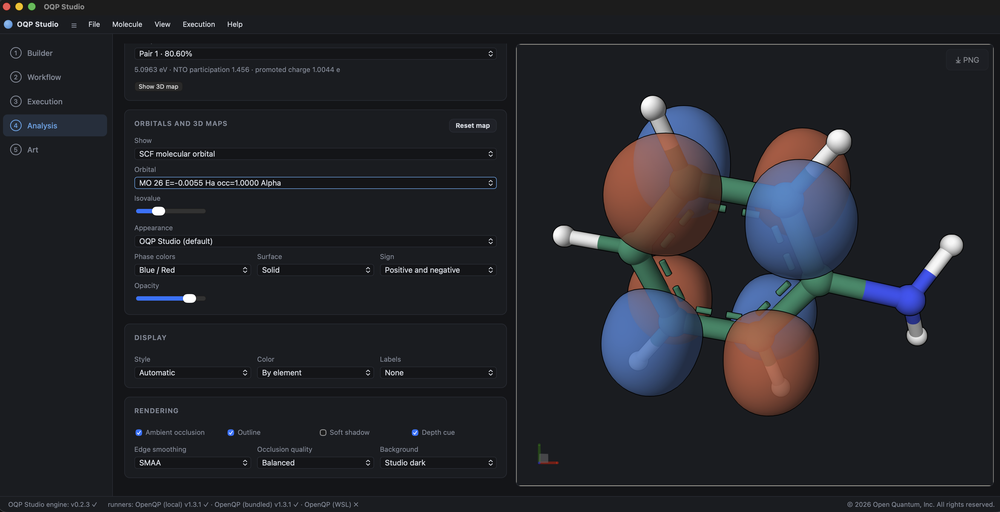

# Analysis

Select a project in **Jobs** to reset the previous display and load only that
project's structures, properties, spectra, and files. The job table uses the
project name; the short internal identifier is retained only for unique storage.

## Job and file controls

Depending on status, a job provides controls to open, stop, restart, or delete
it. Deleting a project removes its managed result directory and should be used
only after preserving any files needed elsewhere.

**Project files** lists the actual input and output files. Selecting a supported
file updates the structure or data source. Optimization, IRC, NEB, dynamics,
and other multi-frame results expose a frame or optimization-step control.
**Edit in Builder** sends the selected structure back to Builder for a new
calculation.

## Results summary

The summary distinguishes the reference SCF energy from correlated or
state-specific results. For DFT and HF jobs, the SCF energy is normally the
principal electronic energy. For MRSF-TDDFT, correlated, EKT, and other methods,
use the separately labeled state or method energies; an SCF reference energy is
not an MRSF-TDDFT state energy.

Available summaries can include:

- total and state energies, excitation energies, and oscillator strengths;
- optimization convergence and step data;
- dipole and atomic population results;
- EKT ionization/electron-affinity roots and Dyson strengths;
- NMR shielding tensors and isotropic values; and
- vibrational frequencies and thermochemical quantities.

## Structures and reaction paths

Optimization steps can be selected individually. The selected step updates the
molecular structure, its recorded values, and state-resolved plots where those
values were written for each step. Reaction-path calculations display relative
energy against the path coordinate; selecting a point selects its structure.

**Compare projects** reports current-minus-reference energy, aligned Cartesian
RMSD, dipole-magnitude change, and matched excited-state changes when the two
projects contain the required data. It does not merge or rename either project.

## Spectra

Studio shows only spectrum types supported by the selected project's output:

- **Absorption** uses S0-to-excited-state energies and oscillator strengths.
- **Emission** is offered for an excited-state structure with the corresponding
  downward transition data, not merely for a vertical excitation at S0 geometry.
- **Excited-state absorption (ESA)** uses transitions from the selected current
  excited state to higher states. For example, S1-to-S2 uses its own transition
  energy, not the absolute S2 energy.
- **IR** uses calculated frequencies and intensities.
- **Photoelectron** and **inverse photoelectron** spectra use EKT IP/EA roots
  and Dyson strengths.

Electronic transition energies are converted to wavelength with
`lambda (nm) = 1239.841984 / Delta E (eV)`. Zero or non-positive transition
energies are excluded rather than producing an unbounded wavelength axis.
Choose Lorentzian, Gaussian, or pseudo-Voigt broadening, adjust the FWHM, and
export the sticks and curve as CSV.

## Orbitals and volumetric maps

**SCF molecular orbital** lists orbitals from the normal SCF Molden output.
Selecting an orbital generates its surface; no orbital is shown until one is
selected. **Reset map** returns to the molecule.

*Analysis links the selected orbital and its energy and occupation to the
three-dimensional positive and negative phases. The isovalue, color pair,
surface style, sign, and opacity controls change the visualization without
changing the calculated orbital.*

For an IP/EA job with a Dyson Molden file, **Dyson orbital** appears as a
separate Show choice. Dyson orbitals are state specific and are labeled by IP
or EA root and source state where available. OpenQP's Dyson `STRENGTH` is shown
as strength; the corresponding occupation contribution is twice that value.
It is not mixed into the SCF orbital list.

Electron density, spin density, and electrostatic potential maps are generated
when the orbital data needed for them are available. Existing cube files can be
displayed directly. Two compatible grids can be summed or subtracted; Studio
rejects grids whose dimensions, origin, axes, or atoms do not match instead of
silently resampling them.

## Excited-state maps and NTOs

When OpenQP exports the state-resolved transition density and matching
Cartesian-basis orbital information, **Excited-state analysis** provides:

- NTO hole and particle pairs with singular-value weights;
- attachment and detachment densities;
- difference and transition densities; and
- target-state density.

Choose source and target states, then choose the map. If the required saved
transition density is absent, Studio reports that the analysis is unavailable;
it does not construct an NTO from excitation energies alone. A rerun may require
`guess(save_mol=true)` and an OpenQP build that exports the relevant
`OQP::td_trans_density_mo` result.

## Normal modes

For a Hessian result, choose a value from **Choose a normal mode**. Selection
alone displays the equilibrium molecule with optional displacement arrows.
**Play** animates displacement continuously about the equilibrium structure;
**Pause** stops at the current phase, and **Reset** restores equilibrium.
Arrow visibility is independent of animation state. The amplitude control
changes the visual displacement and does not alter the calculated normal mode.

## Atomic properties

Atomic data can be displayed as labeled 3D maps, including Mulliken, Lowdin,
and RESP charges and coupled NMR shielding when exported by OpenQP. The legend
shows the numeric range. These atom-centered maps are distinct from volumetric
cube surfaces.
